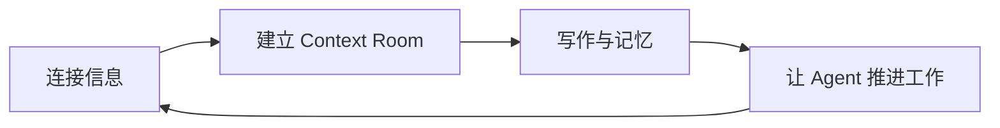
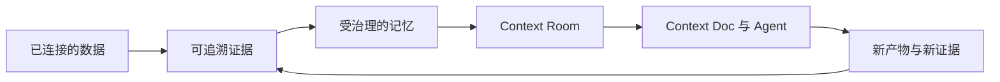
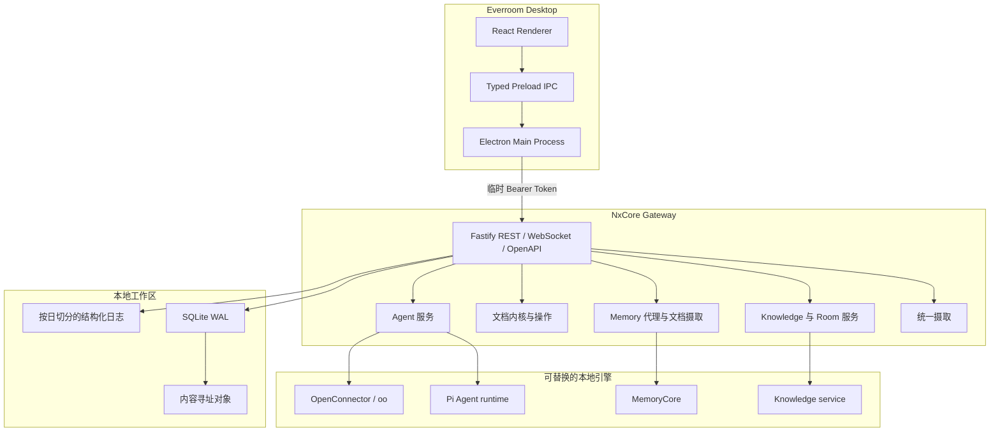

<div align="center">


**一个本地优先的个人上下文工作空间，把文件、对话、记忆和 AI Agent 放回同一个工作现场。**


连接信息 · 理解上下文 · 推进下一步


# EverRoom

[English](./README.md) | [简体中文](./README.zh-CN.md) | [官网](https://r.nxcore.ai/)

[](https://www.star-history.com/nxcoreai/everroom)


</div>

> [!IMPORTANT]
> Everroom 当前处于 Alpha 阶段，macOS 是主要开发目标。产品和 API 正在快速迭代，部分能力需要可选的本地服务或模型配置。


## Everroom 是什么？

Everroom 是面向个人的上下文工作空间：把文件、代码仓库、沟通记录、会议、记忆和 Agent 放在同一个工作现场。你可以把它理解为下一代 Notion / Obsidian，但核心不是存放内容，而是让内容持续理解你的工作，并帮助你推进下一步。

它位于个人数据与 AI Agent 之间：将信息变成可追溯证据，将证据沉淀为受治理的记忆，再把与目标相关的上下文组织进 **Context Room**，让文档和 Agent 获得完成任务所需的信息，而不是一份失控的全量提示词。

> **让 AI 持续理解你，让你的积累随时发挥作用。**

### 你会怎样使用 Everroom？



1. **连接信息：** 导入本地文件、代码仓库、会议和录音，也可以按需连接飞书、Slack、Notion、Gmail 等服务。
2. **建立 Context Room：** 为项目、主题、人物或长期职责建立一个工作空间，把文档、决策、任务、Wiki 和记忆放在一起。
3. **写作与记忆：** 在 Context Doc 中写作和修改，使用现实感知记录真实对话，让重要内容始终能回到来源。
4. **推进工作：** 启动有边界的 Agent 会话，使用 Agent Office 查看执行状态，并通过日记和定时任务处理重复工作。

Everroom 不是另一个聊天窗口，也不是被动堆积文件的笔记库。它是一张可以被你检查、修正和持续使用的上下文工作台。

## 为什么需要 Everroom？

当 AI 拥有正确的上下文时，给出下一步并不难。真正困难的是此前的工作：找到相关材料，区分事实与推测，记住已经做过的决定，并让生成结果始终能够关联回原始来源。

Everroom 补上的正是这一层。它围绕文档、代码仓库、对话、会议和已连接应用构建个人工作空间，而不是一个通用聊天客户端、简单的 RAG 界面，或默默堆积未经审阅摘要的笔记库。

产品主张很简单：

> **上下文应当由证据组装，被限定在具体的工作空间中，并且清晰到足以由人来治理。**



产品遵循四项原则：

- **本地优先：** 数据、索引、工作记忆和文档默认保存在用户设备上。
- **证据先于结论：** 关键记忆和生成内容应当能够回到原始来源。
- **自动化但可治理：** Agent 获得明确、临时且可撤销的上下文和工具权限。
- **底座可替换：** 模型、记忆引擎、连接器和 Agent runtime 均通过 Everroom 自有接口接入。

这个闭环是可逆的。只有当人能够检查生成摘要来自哪里、修正它，并让修正进入下一次任务时，摘要才真正有用。

## 产品模型

| 概念 | 在产品中的作用 | 它所保护的边界 |
| --- | --- | --- |
| **Evidence** | 带位置与溯源信息、可寻址且有版本的源材料 | 区分原始来源和模型解释 |
| **Knowledge** | 从证据建立的 Wiki 页面、实体、链接和路由决策 | 在不静默吸收全部数据的前提下形成稳定项目知识 |
| **Memory** | 对话捕获和 MemoryCore L0-L3 分层推导 | 形成跨会话连续性，同时保留可见的生命周期 |
| **Context Room** | 面向项目、人物、主题或长期职责的工作界面 | 使用有边界的上下文，而不是全局 Prompt 堆积 |
| **Context Docs** | Agent 可通过可审阅操作创建或编辑的版本化文档 | 确保最终产物仍由人掌控 |
| **Agent** | 拥有明确工具、会话、运行记录和取消能力的任务执行者 | 让自动化能够被检查、停止和替换 |

### 一个 Room 如何工作？

Room 不只是文件夹，而是围绕一项工作逐步组装出的上下文视图：

1. 来源被关联到 Room，并保留稳定身份和版本历史。
2. 路由与证据检查决定材料应成为 Room Wiki、实体候选、记忆文档，还是仅保留链接。
3. Room Profile 从已确认材料中整理当前目标、状态、人物、风险、决策和时间线。
4. Agent 只会获得当前请求需要的 Room 范围工具和文档。
5. 文档修改通过文档内核提交、记录为操作，并重新进入统一摄取链路。

因此，Room 可以随着使用持续变得更有价值，同时不会把每一份来源都强行变成永久记忆。

### 产品边界

Everroom 当前不会从连续屏幕录制、自治多 Agent 集群、企业管理或强制云端同步开始。首个版本聚焦可信的本地上下文和可审阅的工作闭环。

## 当前进度

仓库已经具备首个本地工作流所需的桌面端和后端基础设施。

| 模块 | 状态 | 当前能力 |
| --- | --- | --- |
| 桌面工作空间 | 已可用 | Electron + React 工作空间，包含首页、Context Room、文档、记忆、数据源、文件、日记和 Agent Office |
| NxCore Gateway | 已可用 | 由 Electron 管理的独立 Fastify 服务，覆盖开发和打包运行方式 |
| API 边界 | 已可用 | TypeBox 校验、OpenAPI 文档、Bearer 鉴权、健康检查和 WebSocket |
| 本地存储 | 已可用 | SQLite WAL、Drizzle migration、内容寻址对象与 FTS5 证据检索 |
| 数据源与文件 | 已可用，持续完善 | 本地文件浏览、文件夹导入、GitHub 与可选外部连接器 |
| OpenConnector | 已可用 | 通过 oo CLI 搜索、检查并执行 Action，提供桌面控制台与 Agent 工具 |
| 证据与理解 | 已可用，持续完善 | Markdown、纯文本、Office / Web 内容解析，文件版本、来源位置和可追溯证据块 |
| Context Room 与 Wiki | 已可用，持续完善 | Room 注册、项目 Wiki、实体路由、来源挂载和搜索读取 |
| Agent 服务 | 已可用，持续完善 | Pi 与开发 runtime、持久化会话、运行记录、流式事件、取消和上下文工具 |
| Memory | 已可用，按配置启用 | MemoryCore L0-L3 分层记忆、对话、原子记忆、搜索和降级状态 |
| Context Docs | 已可用，持续完善 | Tiptap 版本化文档、块级操作、可审阅 Agent 修改、MCP 接口和事务化下游摄取 |
| 现实感知 | 已可用，持续完善 | 麦克风 / 系统音频采集、转写和可审阅的对话记录 |
| Agent 工作管理 | 已可用，持续完善 | Agent Office、定时任务、日记任务和手动执行 |
| Connectors | 基础能力已可用 | 托管本地 OpenConnector、`oo` bridge、可选 Nango 集成，连接器覆盖持续扩展 |

## 技术架构

Electron 负责桌面应用生命周期，并将 NxCore Gateway 作为独立本地服务启动。Renderer 无法直接访问数据库、文件系统或 Gateway 凭据；所有 IPC 请求由主进程处理，再由主进程将授权后的 REST 与 WebSocket 流量转发给 Gateway。



Electron 负责窗口、进程生命周期和权限边界；NxCore Gateway 是独立的本地后端服务，负责 Agent、数据摄取、知识、记忆、文档、文件和连接器编排。Renderer 不能直接访问数据库、文件系统或 Gateway 凭据。

### 实现策略

- **一次规范化，在合适位置完成理解。** 摄取层识别并规范化来源，再依据已记录的策略快照分发给 Knowledge、Memory 或 Room 链接，不额外制造一条 LLM 管道。
- **一份资产，多处引用。** 原始文件与解析后的 Markdown 只有一个存储所有者，下游通过稳定引用、哈希和溯源信息使用它们。
- **Room 范围上下文。** Knowledge 工具先解析当前 Room 或会话，再读取 Wiki、来源和材料；Agent 默认不会获得无边界的全局语料。
- **先提交，再执行副作用。** 文档修改先通过事务化提交内核与 outbox 落盘，再分发给 Knowledge 和 Memory，外部服务失败不会破坏权威文档版本。
- **确定性的外部操作。** Connector 调用基于真实 Action Schema 和连接准备，凭据留在可信进程中；破坏性或对外可见的操作需要确认边界。
- **优雅降级。** Fake Agent、未启用的 MemoryCore、不可用连接器和模型错误都有明确状态，可选服务缺失不会让本地文档不可访问。

### 技术栈

| 层级 | 技术 |
| --- | --- |
| 桌面端 | Electron、React、TypeScript、electron-vite |
| Gateway | Node.js 22+、Fastify 5、TypeBox |
| API | REST、WebSocket、OpenAPI |
| 存储 | SQLite WAL、better-sqlite3、Drizzle ORM、FTS5 |
| Agent 边界 | 共享协议包与可替换 runtime adapter |
| 日志 | Pino、可读终端输出、按日切分的 JSON 文件日志 |
| 测试 | Vitest 与 TypeScript 严格检查 |

## 快速开始

### 环境要求

- macOS
- Node.js 22 或更高版本
- pnpm 11.15.1，或兼容的 pnpm 11 版本

### 启动桌面应用

```bash
git clone https://github.com/NxcoreAI/Everroom.git
cd Everroom
pnpm install
pnpm dev
```

`pnpm dev` 会启动 Electron 和 Renderer，并由 Electron 以 watch 模式管理独立 Gateway。Gateway 默认使用动态 loopback 端口，避免多个开发实例冲突；修改 Gateway TypeScript 代码后会自动重启。需要固定端口时设置 `NXCORE_GATEWAY_DEV_PORT=4100`。

桌面端侧栏左下角会展示 Gateway 当前状态与进程 PID。

### Agent 服务

Gateway 会读取仓库根目录的 `.env`，也兼容 `apps/gateway/.env` 和通过 `NXCORE_ENV_FILE` 指定的文件。默认使用隔离的 `fake` runtime，确保没有模型密钥时桌面应用仍可启动。需要真实 Agent 时，配置内置 Pi runtime；Context Room 文档工具会直接注入 Agent：

Gateway 中的生成式模型调用统一通过 `AgentResolver` 按稳定 ID 选择 Agent。主对话、Connector 同步、转写总结、Cursor Completion、Knowledge 抽取/判定/登记和 Web Search 都拥有独立的 Runtime 与 `config/sessions/workspace` 目录；业务模块不直接调用 LLM API。向量 Embedding 是非生成式基础设施能力，不经过 Agent Resolver。

```dotenv
NXCORE_AGENT_RUNTIME=pi
NXCORE_AI_PROVIDER=openai
NXCORE_AI_MODEL=gpt-5.2
NXCORE_AI_BASE_URL=https://api.openai.com/v1
NXCORE_AI_API_KEY=
NXCORE_AI_API=openai-responses
```

NxCore Gateway 同时提供受 Bearer Token 保护的 `/v1/mcp/documents/:sessionId` Streamable HTTP MCP 入口，供经过认证的 MCP 客户端使用。已废弃的远端聊天传输不再属于 runtime 配置。

#### 文件驱动的子 Agent

子 Agent 只能被主 Agent 或 Gateway 内部工作流调度，不提供独立聊天入口，也不需要管理页面。Gateway 默认扫描仓库根目录的 `agents`。该目录在 Gateway 构建时复制到 `dist/agents`，并随 Desktop 一起打包；开发或测试时可以通过环境变量临时覆盖：

```dotenv
NXCORE_SUBAGENTS_ENABLED=true
NXCORE_SUBAGENTS_DIR=/absolute/path/to/everroom-agents
```

每个一级子目录代表一个 Agent：

```text
everroom-agents/
└── mail-researcher/
    ├── agent.yaml
    ├── SYSTEM.md
    └── skills/
        └── summarize/
            └── SKILL.md
```

最小 `agent.yaml`：

```yaml
schemaVersion: 1
id: mail-researcher
name: 邮件研究员
description: 检索邮件并返回带来源的摘要
mode: dispatch_only
systemPrompt: ./SYSTEM.md
skills:
  - ./skills/summarize
mcp:
  - server: gmail
    includeTools: [search_messages, get_message]
policy:
  allowedCallers: [primary-agent]
  timeoutMs: 300000
  maxConcurrency: 1
  maxToolCalls: 40
```

`mcp.server` 引用设置中已有的全局 MCP 服务器名称，子 Agent 只会看到自己绑定并通过 `includeTools` 筛选后的服务器。修改目录内容后重启 Gateway 会自动生成新的不可变 Revision；已有 Invocation 继续使用原 Revision。完整约束见 [`docs/subagent-framework-design.zh-CN.md`](./docs/subagent-framework-design.zh-CN.md)。

每个 `SKILL.md` 必须包含 `name` 和 `description` YAML frontmatter。子 Agent 通过受限 `read` 工具读取自己的 Skill 快照，不能借此读取工作区或设备上的其他文件。MCP 的 `includeTools` 必须显式填写；需要开放服务器全部工具时使用 `["*"]`。

### 可选的本地 MemoryCore 与 Knowledge 服务

功能开关启用后，Desktop 会管理兼容的本地服务。默认使用以下 loopback 地址：

```dotenv
NXCORE_MEMORY_ENABLED=true
NXCORE_MEMORY_BASE_URL=http://127.0.0.1:8420
NXCORE_KNOWLEDGE_ENABLED=true
NXCORE_KNOWLEDGE_BASE_URL=http://127.0.0.1:8421
```

MemoryCore 来自 EverRoom 维护的 [TencentDB-Agent-Memory Fork](https://github.com/NxcoreAI/TencentDB-Agent-Memory)，服务所需的模型配置留在服务侧。服务被关闭或暂时不可用时，Desktop 会显示明确的降级状态，其余本地工作空间仍可使用。

### 常用命令

```bash
pnpm dev          # 启动桌面端与 Gateway
pnpm typecheck    # 检查所有 workspace 包的类型
pnpm test         # 运行 Agent runtime 与 Gateway 测试
pnpm build        # 构建 Gateway 与 Electron
pnpm package:mac  # 生成 macOS DMG 与 ZIP
pnpm package:win  # 生成 Windows NSIS 安装包（需在 Windows 上执行）
```

### 桌面端发布

桌面端发布由 GitHub Actions 的 `release-desktop.yml`（"Release desktop app"）驱动。向仓库推送 `desktop-vX.Y.Z` tag（版本号需与 `apps/desktop/package.json` 的 `version` 一致），或通过 Actions 页面手动选择该 tag 运行，即可并行构建并发布到同一个 GitHub Release（prerelease）：

- **macOS arm64**：`EverRoom-<version>-arm64.dmg` 与 `.zip`
- **Windows x64**：`EverRoom-<version>-windows-x64.exe`（NSIS 安装包）

`workflow_dispatch` 手动运行时必须选择已经存在的 `desktop-v*` tag 作为 ref，否则 tag 校验步骤会拒绝执行。维护构建的 `scheduled-desktop-release.yml` 会在每日 00:00（Asia/Shanghai）自动检查 main，为未发布版本创建 nightly tag 并触发构建。

签名配置（均为可选，未配置时产出未签名构建并输出警告）：

- macOS：`MAC_CERTS`（Base64 编码的 Developer ID `.p12`）与 `MAC_CERTS_PASSWORD`
- Windows：`WIN_CSC_LINK`（Base64 编码的代码签名 `.pfx`）与 `WIN_CSC_KEY_PASSWORD`

Windows 打包依赖原生模块与 NSIS 工具链，需要最终在 Windows 上执行；本地可运行 `pnpm package:win` 复现相同的打包过程。

## Gateway

桌面开发模式下，Electron 会从运行时清单发现 Gateway 地址，默认端口是动态分配的：

- API 地址：`http://127.0.0.1:<动态端口>`
- OpenAPI UI：`http://127.0.0.1:<动态端口>/docs`
- 存活检查：`GET /v1/health/live`
- 就绪检查：`GET /v1/health/ready`

健康检查和 API 文档可以通过本地回环地址直接访问，其余接口需要 Electron 生成的临时 Bearer Token。Token 只保存在主进程，不会暴露给 Renderer。

Gateway 也可以独立启动：

```bash
pnpm --dir apps/gateway dev -- \
  --data-dir .data \
  --port 4100 \
  --token local-development-token
```

服务端细节见 [`apps/gateway/README.md`](./apps/gateway/README.md)。

## 本地数据

macOS 默认运行时目录：

```text
~/Library/Application Support/NxCore/
├── database/   # Gateway 与桌面端 SQLite 数据库
├── logs/       # Gateway 按日切分的 JSON 日志
├── objects/    # 内容寻址的来源文件
└── runtime/    # 临时 Gateway 发现清单
```

Gateway 日志命名为 `gateway.YYYY-MM-DD.N.log`，每天零点切分，保留 30 个历史文件，并自动脱敏已知凭据。终端日志使用可读的本地时间。

## 仓库结构

```text
Everroom/
├── apps/
│   ├── desktop/          # Electron main、preload 与 React renderer
│   └── gateway/          # 独立本地后端服务
├── packages/
│   ├── agent-contract/   # 共享 Agent 协议与事件类型
│   ├── agent-runtime/    # Runtime 接口与开发 adapter
│   ├── agent-runtime-pi/ # Pi runtime、记忆、知识和连接器工具
│   ├── connector-contract/ # 共享 Connector 同步与标准化数据协议
│   ├── document-model/   # 纯文档规范化与块引用
│   └── reality-contract/ # 现实感知与事件共享协议
└── docs/                 # 产品、架构和实施说明
```

## 路线图

当前重点是让本地工作闭环更可靠、更容易扩展：

1. 完善本地文件、GitHub、飞书、网页和连接器数据的统一导入体验。
2. 增强证据审阅：冲突展示、来源跳转、手动挂载 / 撤销和源级诊断。
3. 提升长期项目中的 Room Profile、Wiki 检索和记忆治理能力。
4. 完善 Context Doc 的操作恢复、冲突处理和带引用的 Agent 工作流。
5. 扩展可替换 Agent adapter，逐步接入 Codex、Claude Code 和 OpenCode。
6. 扩大移动端与桌面端的双向同步和 Agent 控制能力，同时保持本地权限边界清晰。
7. 提升 Windows 支持、隐私排除、安装体验和发布稳定性。

连续屏幕录制、自治多 Agent DAG、企业管理和强制云端同步仍不属于当前首版范围。

## 开源协议与贡献

社区版计划包含桌面客户端、基础 Room 与 Doc 体验、Agent runtime 边界、基础 Memory Kernel、本地 Connector 和扩展 SDK。托管同步、团队管理、企业控制与托管连接器基础设施可能单独提供。

Everroom 以 [Apache License 2.0](./LICENSE) 开源。第三方组件仍适用各自的上游许可证；请以对应目录中的许可证和声明文件为准。

## 致谢

Everroom 建立在众多开源项目和理念之上：

- [Electron](https://www.electronjs.org/) 与 [React](https://react.dev/) 提供桌面应用基础。
- [Fastify](https://fastify.dev/)、[TypeBox](https://github.com/sinclairzx81/typebox)、[Drizzle ORM](https://orm.drizzle.team/) 和 [SQLite](https://www.sqlite.org/) 提供本地服务与存储层。
- [TencentDB-Agent-Memory](https://github.com/TencentCloud/TencentDB-Agent-Memory) 通过 [NxcoreAI Fork](https://github.com/NxcoreAI/TencentDB-Agent-Memory) 为 Everroom 提供分层 MemoryCore 管道。
- [Pi](https://github.com/earendil-works/pi) 与 Model Context Protocol 生态为可替换 Agent runtime 方向提供基础。
- OOMOL 的 [OpenConnector](https://github.com/oomol-lab/open-connector) 与 [`oo-cli`](https://github.com/oomol-lab/oo-cli) 提供本地 Connector Bridge。
- [Liminon](https://liminon.ai/) 为 AI 工作流和上下文产品方向提供启发。
- [Nango](https://nango.dev/) 提供 Connector 集成和 OAuth 管理能力。

## 安全模型

- 数据、索引、工作记忆和文档默认保存在用户设备上。
- Gateway 只监听本地回环地址，每次桌面会话使用新的高熵 Token。
- Renderer 只能访问类型化 preload API；文件系统、数据库、模型 Token 和 MemoryCore 凭据保留在可信进程中。
- 原始来源以内容寻址方式保存版本；下游能力支持时，派生知识和记忆会保留来源引用。
- 云服务、远程模型和外部 Agent 均为可选能力，并且只应获得用户批准的 Room 或任务范围。
- 日志会自动脱敏敏感请求头与凭据，托管连接器配置文件使用受限权限。
- 对外产生影响的操作与只读上下文收集相互分离，并应经过明确的准备与确认边界。

## 参与贡献

Everroom 仍处于早期阶段，接口会持续演进。当前有价值的贡献方向包括 Connector、Agent adapter、记忆评估器、Room 模板、测试、文档和隐私审查。开始大规模架构改动前，请先创建 Issue，确保实现与当前契约和路线图保持一致。
